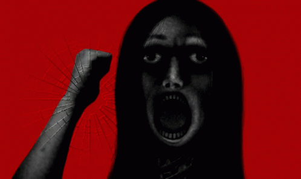

# FiveM Jumpscare 👻
This resource adds a simple and easily configurable jumpscare command which can be used to scare players or yourself

## 📜 Usage
- To scare a player use the command `/jumpscare <playerId>`.
- You can also test it in browser by opening `html/index.html` in a browser and calling `Trigger()` from the developer console. Just dont forget that this will jumpscare you.

## ⬇️ Install & Permissions
- The command is registered as restricted in `server.lua` so you must grant ACE permission.
- Ensure resource and configure permission in your server.cfg:
```
ensure FiveM-Jumpscare
add_ace group.admin "command.jumpscare" allow
```

## 📦 Configure
### 📂 Jumpscare Files
- In the html folder there is an `image.gif` and a `sound.ogg` file.
- You can just replace them with your own files but the names have to be the same.

### 🏷️ Change File Names
- If you want to change the name or extension of the jumpscare files then you also need to change 
them in `html/index.html` and in `fxmanifest.lua`.

### 🔊 Change Sound Volume
- You can change the sound volume by modifying the `sound.volume` property in `html/app.js`. 
- It ranges from 0.0 to 1.0 (0.2 = 20%, 0.6 = 60% etc...).

### 👁️ Remove Black Screen
- If you want to remove the black screen that appears before the jumpscare then move the line `document.body.style.display = "block"` in `html/app.js` down into the scope of the first setTimeout call.

- #### Before:
```js
const sound = document.getElementById("sound")

document.body.style.display = "block"

setTimeout(() => {
    image.style.display = "block"
```
- ##### After:
```js
const sound = document.getElementById("sound")

setTimeout(() => {
	document.body.style.display = "block"
    image.style.display = "block"
```


## 👻 Default Jumpscare Credits
- The default jumpscare is from [Lomando](https://lomando.fandom.com/wiki/Lomando_Wiki).
- It is a Japanese browser horror game developed by Nohito.

